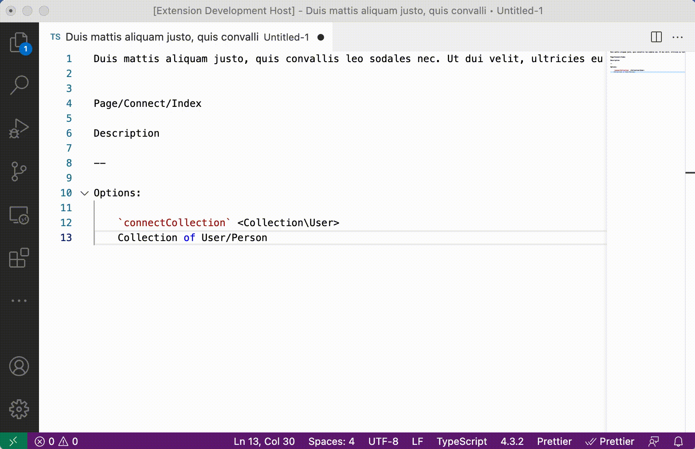

# Ascii Box Comments

[](https://marketplace.visualstudio.com/items?itemName=polymermallard.box-comment)
[](https://marketplace.visualstudio.com/items?itemName=polymermallard.box-comment)
[](https://www.patreon.com/mattkenefick)
[](https://paypal.me/polymermallard)

Generates a clean comment box using ascii box drawing characters around a selection.
Inspired by this prototype: https://prototypes.polymermallard.com/docblock/index.html




## Example

```PHP
#
# ┌────────────────────────────────────────────────────────────────────────────┐
# │                                                                            │
# │ This is a comment of documentation (Doc Block)                             │
# │                                                                            │
# │ @param Request $request                                                    │
# │ @return Response                                                           │
# │ @throws \Exception                                                         │
# │                                                                            │
# └────────────────────────────────────────────────────────────────────────────┘
#
```

## Configuration

The plugin defaults to single line box drawing and 80 characters wide. You can change these in your settings:

```
"box-comment.chars": {
        "tl": "╔",
        "tm": "═",
        "tr": "╗",
        "l" : "║",
        "r" : "║",
        "bl": "╚",
        "bm": "═",
        "br": "╝",
        "dl": "╠",
        "dm": "═",
        "dr": "╣"
    },
"box-comment.length": 60
```

## Usage

Three commands exist:

    - Create comment box (via config)
    - Create comment box (80 wide)
    - Create comment box (120 wide)

The configuration setting is a numerical value for `box-comment.length`.

## Key Bindings

For Mac/PC: `shift+cmd+;` / `shift+alt+;` will run `Create comment box (via config)`

## Special Features

Dividers are supported by using two hyphens: `--`

```
Lorem ipsum dolor sit amet
--
Consectetur adipiscing elit
```

Becomes:

```
// ╔══════════════════════════════════════════════════════════╗
// ║ Lorem ipsum dolor sit amet                               ║
// ╠══════════════════════════════════════════════════════════╣
// ║ Consectetur adipiscing elit                              ║
// ╚══════════════════════════════════════════════════════════╝
```

## Release Notes

### 0.0.1

Initial creation of Box Comment
